# AgentOS Community

This repository is the hub of the AgentOS community—open-source plugins, components, apps, and agent configs for [AgentOS](https://github.com/jcontini/agentOS-core).

---

## What is AgentOS?

**AgentOS is the semantic layer between AI assistants and your digital life.**

Your tasks are in Todoist. Your calendar is in Google. Your messages are split across iMessage, WhatsApp, Slack. Your files are everywhere. Each service is a walled garden—they don't talk to each other, and switching is painful.

**AgentOS fixes this.** It gives AI assistants a unified way to access all your services through a universal language. Your AI can manage tasks, read your calendar, send messages, and search the web—all through one interface, regardless of which service you use.

### The Vision

**You should own your digital life.** Not rent it. Not have it held hostage. Own it.

AgentOS creates a universal entity model—tasks, events, contacts, messages, files—that works across all services. A Todoist plugin maps Todoist's API to the universal `task` entity. A Linear plugin does the same. From your AI's perspective, they're identical: `task.list()`, `task.create()`, `task.complete()`.

This means:
- **Migration is trivial** — Switch from Todoist to Linear? Same entity, different backend
- **Cross-service queries work** — "Show tasks due today from all sources"
- **AI understands everything** — One schema, not 50 proprietary formats
- **You're in control** — Your data, your computer, your rules

### How It Works

```mermaid
%%{init: {'theme': 'dark', 'themeVariables': { 'fontSize': '16px', 'fontFamily': 'ui-monospace, monospace', 'lineColor': '#6b7280', 'primaryTextColor': '#f3f4f6', 'edgeLabelBackground': '#1a1a2e' }}}%%
flowchart TB
    subgraph Container[" "]
        direction TB
        subgraph AgentGroup["AI Assistants"]
            direction LR
            Claude(["Claude"])
            Cursor(["Cursor"])
            ChatGPT(["ChatGPT"])
        end
        
        subgraph Cloud["Cloud Relay"]
            Relay(["⚡ Cloudflare Worker"])
        end
        
        subgraph Core["AgentOS Core"]
            direction TB
            subgraph CoreTop[" "]
                direction LR
                MCP(["📡 MCP Server"])
                UI(["🖥️ React UI"])
            end
            subgraph CoreBottom[" "]
                direction LR
                Plugins(["⚡ Plugins"])
                Creds(["🔑 Credentials"])
                Logs(["📋 Activity Logs"])
            end
        end
        
        subgraph External["Your Services"]
            direction LR
            Online(["☁️ Online APIs"])
            Offline(["💻 Local Apps"])
        end
        
        Claude -->|STDIO| MCP
        Cursor -->|STDIO| MCP
        ChatGPT -.->|HTTPS| Relay
        Relay -.->|WebSocket| MCP
        UI -->|invoke| Plugins
        UI -->|invoke| Creds
        MCP --> Plugins
        MCP --> Creds
        MCP --> Logs
        Plugins --> Online
        Plugins --> Offline
    end
    
    style Container fill:#1a1a2e,stroke:#4a4a6a,stroke-width:2px,rx:10,ry:10
    style AgentGroup fill:#2d1f1a,stroke:#f59e0b,stroke-width:2px,rx:8,ry:8,color:#fef3c7
    style Cloud fill:#1a2d3d,stroke:#6b7280,stroke-width:2px,stroke-dasharray:5 5,rx:8,ry:8,color:#9ca3af
    style Core fill:#3b1d6e,stroke:#a78bfa,stroke-width:2px,rx:8,ry:8,color:#f3f4f6
    style CoreTop fill:transparent,stroke:transparent
    style CoreBottom fill:transparent,stroke:transparent
    style External fill:#0f3d3a,stroke:#14b8a6,stroke-width:2px,rx:8,ry:8,color:#ccfbf1
    
    style Claude fill:#5a2a1a,stroke:#D97757,stroke-width:2px,color:#fcd5c5
    style Cursor fill:#1e3a5f,stroke:#3B82F6,stroke-width:2px,color:#dbeafe
    style ChatGPT fill:#0d3d2d,stroke:#10A37F,stroke-width:2px,stroke-dasharray:5 5,color:#d1fae5
    
    style Relay fill:#1a2d3d,stroke:#6b7280,stroke-width:2px,stroke-dasharray:5 5,color:#9ca3af
    
    style MCP fill:#4c1d95,stroke:#a78bfa,stroke-width:2px,color:#f3f4f6
    style UI fill:#4c1d95,stroke:#a78bfa,stroke-width:2px,color:#f3f4f6
    style Plugins fill:#4c1d95,stroke:#a78bfa,stroke-width:2px,color:#f3f4f6
    style Creds fill:#064e3b,stroke:#10b981,stroke-width:2px,color:#d1fae5
    style Logs fill:#374151,stroke:#9ca3af,stroke-width:2px,color:#f3f4f6
    
    style Online fill:#134e4a,stroke:#14b8a6,stroke-width:2px,color:#ccfbf1
    style Offline fill:#134e4a,stroke:#14b8a6,stroke-width:2px,color:#ccfbf1
    
    linkStyle 0 stroke:#D97757,stroke-width:2px
    linkStyle 1 stroke:#3B82F6,stroke-width:2px
    linkStyle 2 stroke:#10A37F,stroke-width:2px,stroke-dasharray:5 5
    linkStyle 3 stroke:#6b7280,stroke-width:2px,stroke-dasharray:5 5
    linkStyle 4,5 stroke:#a78bfa,stroke-width:2px
    linkStyle 6,7,8 stroke:#a78bfa,stroke-width:2px
    linkStyle 9,10 stroke:#14b8a6,stroke-width:2px
```



**Plugins are adapters.** They translate between your services' APIs and AgentOS's universal entities. You enable a plugin once, and any AI assistant can use it.

**The UI shows you what's happening.** When your AI searches the web, you see results appear. When it creates a task, you see it in the task list. You're watching AI work—like looking over a colleague's shoulder. This transparency builds trust.

### The Entity Graph

AgentOS uses a universal entity model where everything connects:


This graph structure means:
- **Cross-service queries work** — "Show tasks assigned to Sarah from all sources"
- **Relationships are bidirectional** — From a task, see its project; from a project, see all tasks
- **Migration is easy** — Same graph structure, different backends

### What You Can Do

- **Let AI manage your tasks** — "Create a task to review the PR" → Done
- **Cross-service queries** — "What did I discuss with Sarah last week?" → Searches messages, emails, calendar
- **Unified calendar** — See events from Google Calendar, Apple Calendar, Outlook in one place
- **Smart workflows** — "Every morning, summarize unread emails and add tasks for action items"
- **Easy migration** — Switch from Todoist to Linear without losing data or relationships

### For Everyone

**You don't need to be technical to use AgentOS.** Enable plugins, connect your services, and your AI assistants can use them. The community builds the plugins—you just use them.

**You don't need to code to contribute.** Found a bug? Want a new plugin? Have an idea? Open an issue. The community is here to help.

---

## What's Here

This repository contains everything the AgentOS community builds:

```
plugins/           Service integrations (Linear, Todoist, Exa, etc.)
components/        Reusable UI building blocks
apps/              Capability renderers (Browser, Tasks, etc.)
agents/            Setup instructions for AI clients (Cursor, Claude, etc.)
```

### Plugins

Connect AgentOS to external services. Each plugin is YAML config + docs—no code required.

```
plugins/
  linear/
    readme.md       # YAML config + markdown docs
    icon.png        # Square icon
    tests/          # Integration tests
  todoist/
  exa/
  ...
```

| Category | Plugins |
|----------|---------|
| Tasks | todoist, linear |
| Messages | imessage, whatsapp |
| Databases | postgres, sqlite, mysql |
| Calendar | apple-calendar |
| Contacts | apple-contacts |
| Web | exa, firecrawl, reddit |
| Books | hardcover, goodreads |

### Components

Reusable UI pieces that compose atoms (text, image, icon, container).

```
components/
  url-bar/          # Location bar for browser views
  search-result/    # Search result card
  ...
```

### Apps

Render capabilities with components. Define how data is displayed.

```
apps/
  browser/          # Renders web_search, web_read
  ...
```

### Agents

Setup instructions for AI clients that use AgentOS via MCP.

```
agents/
  cursor/           # Cursor IDE setup
  claude/           # Claude Desktop setup
  raycast/           # Raycast setup
  ...
```

---

## Contributing

**Anyone can contribute.** You don't need to code. Found a bug? Want a new plugin? Have an idea? [Open an issue](https://github.com/jcontini/agentos-community/issues) or see [CONTRIBUTING.md](CONTRIBUTING.md) for how to build plugins.

**The community builds everything.** Plugins, components, apps, themes—all open source, all MIT licensed, all yours forever.

---

## License

**MIT** — see [LICENSE](LICENSE)

By contributing, you grant AgentOS the right to use your contributions in official releases, including commercial offerings. Your code stays open forever. See [CONTRIBUTING.md](CONTRIBUTING.md) for full terms.

---

## For Developers

### Development Setup

```bash
git clone https://github.com/jcontini/agentos-community
cd agentos-community
npm install    # Sets up pre-commit hooks
```

### Testing

**Validation** (schema + test coverage):
```bash
npm run validate              # Check all plugins
```

**Functional tests** (actual API calls):
```bash
npm test                      # Run all tests (excludes .needs-work)
npm run test:needs-work       # Test plugins in .needs-work
npm test plugins/exa/tests    # Test specific plugin
```

**Test structure:** Tests are organized by domain (`tests/plugins/`, `tests/entities/`). See [CONTRIBUTING.md](CONTRIBUTING.md#testing) for details.

**The `.needs-work` folder:** Plugins that fail validation are automatically moved to `plugins/.needs-work/` to keep the main directory clean.

See **[CONTRIBUTING.md](CONTRIBUTING.md)** for plugin development, testing, and contribution terms.
