# Vibe Coach

Structured thinking patterns for clearer communication. Use these when you need to help users think through decisions, understand domains, or compare options.

---

## 1. Comparisons

**When:** User asks "which is better?", "should I use X or Y?", "what's the difference?"

**Format:** Items as columns, criteria as rows.

| | PostgreSQL | MongoDB | SQLite |
|---|---|---|---|
| **Best for** | Complex queries, transactions | Flexible schemas, documents | Embedded, single-user |
| **Scaling** | Vertical + read replicas | Horizontal sharding | Single file |
| **Schema** | Strict, migrations required | Flexible, schema-optional | Strict |
| **Hosting** | Supabase, RDS, self-host | Atlas, self-host | Local file |

**Not:** Pros/cons lists. Those don't help you choose.

**Pattern:**
```
|  | Option A | Option B | Option C |
|---|---|---|---|
| **Criterion 1** | value | value | value |
| **Criterion 2** | value | value | value |
```

---

## 2. Domain Modeling

**When:** Starting a project, refactoring, onboarding, or feeling lost in complexity.

### Process

1. **Discover** - What are the nouns? What verbs connect them?
2. **Define** - One glossary entry per entity
3. **Diagram** - Visualize relationships
4. **Document** - Record decisions

### Glossary

| Entity | Definition |
|--------|------------|
| **Podcasts** | A show with multiple episodes |
| **Episodes** | A single audio file within a podcast |
| **Subscriptions** | A user following a podcast |

### Diagram

```mermaid
%%{init: {'theme': 'dark', 'themeVariables': { 'fontSize': '14px', 'fontFamily': 'ui-monospace, monospace', 'lineColor': '#6b7280', 'primaryTextColor': '#f3f4f6' }}}%%
flowchart LR
    subgraph Container[" "]
        Users(["👤 Users"]) -->|subscribe to| Podcasts(["🎙️ Podcasts"])
        Podcasts -->|have| Episodes(["🎧 Episodes"])
        Users -->|add to| Queue(["📋 Queue"])
        Queue -->|contains| Episodes
    end
    
    style Container fill:#1a1a2e,stroke:#4a4a6a,stroke-width:2px,rx:10,ry:10
    style Users fill:#064e3b,stroke:#10b981,stroke-width:2px,color:#d1fae5
    style Podcasts fill:#4c1d95,stroke:#a78bfa,stroke-width:2px,color:#f3f4f6
    style Episodes fill:#1e3a5f,stroke:#3b82f6,stroke-width:2px,color:#dbeafe
    style Queue fill:#78350f,stroke:#f59e0b,stroke-width:2px,color:#fef3c7
    
    linkStyle 0 stroke:#10b981,stroke-width:2px
    linkStyle 1 stroke:#a78bfa,stroke-width:2px
    linkStyle 2 stroke:#10b981,stroke-width:2px
    linkStyle 3 stroke:#f59e0b,stroke-width:2px
```



**Colors:** One per entity. Use only when referencing that entity.

**Shapes:** Stadium `(["Label"])` with emoji prefix.

**Verbs:** Plain English — "have", "create", "belong to".

---

## 3. Decision Trees

**When:** User needs to choose between paths based on conditions.

```
Need to FIND information or discover URLs?
  → Use search

Have specific URLs to read content from?
  → Use extract
     If JS-heavy or extract fails → Use browser
```

Or as a diagram:

```mermaid
%%{init: {'theme': 'dark', 'themeVariables': { 'fontSize': '14px', 'fontFamily': 'ui-monospace, monospace', 'primaryTextColor': '#f3f4f6' }}}%%
flowchart TD
    Start(["What do you need?"]) --> Find{"Find info?"}
    Find -->|Yes| Search(["🔍 Search"])
    Find -->|No| Have{"Have URLs?"}
    Have -->|Yes| Extract(["📄 Extract"])
    Have -->|No| Search
    Extract -->|Fails| Browser(["🌐 Browser"])
    
    style Start fill:#374151,stroke:#9ca3af,stroke-width:2px,color:#f3f4f6
    style Find fill:#1a1a2e,stroke:#6b7280,stroke-width:2px,color:#f3f4f6
    style Have fill:#1a1a2e,stroke:#6b7280,stroke-width:2px,color:#f3f4f6
    style Search fill:#064e3b,stroke:#10b981,stroke-width:2px,color:#d1fae5
    style Extract fill:#4c1d95,stroke:#a78bfa,stroke-width:2px,color:#f3f4f6
    style Browser fill:#78350f,stroke:#f59e0b,stroke-width:2px,color:#fef3c7
```



---

## 4. Glossary Tables

**When:** Introducing terminology, onboarding, or clarifying concepts.

| Term | Definition |
|------|------------|
| **Skill** | A capability you connect to (Todoist, YouTube) |
| **Agent** | An AI assistant that uses skills (Claude, Cursor) |
| **Activity** | Record of an agent using a skill |

---

## Visual Principles

| Principle | Why |
|-----------|-----|
| **Tables over prose** | Scannable, comparable |
| **Diagrams confirm understanding** | If you can't draw it, you don't get it |
| **Dark mode** | Dark fills, bright strokes, light text |
| **Concrete before abstract** | Example before type |
| **One color per entity** | Consistency creates vocabulary |

## Avoid

- Prose when a table works
- Pros/cons lists for comparisons
- `erDiagram` — use `flowchart`
- Sharp rectangles — use stadium `(["..."])`
- `1:N` notation — use verbs

---

## Output

Use the `render` action to save structured documents as markdown.
